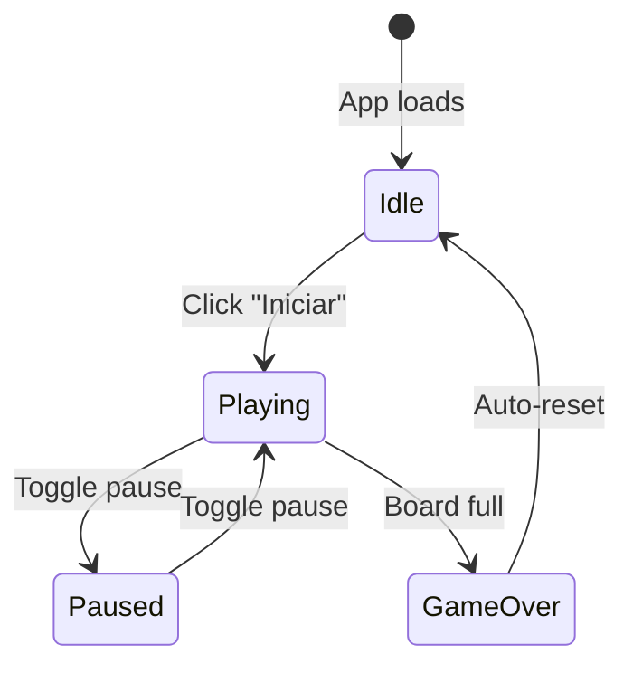

# Data Model: Game Start

## Game State

The game component manages its lifecycle through a combination of boolean states. This feature extends the existing model with an `isStarted` state.

### State Variables

| State         | Type   | Default   | Description                                         |
|--------------|--------|-----------|-----------------------------------------------------|
| gameStatus   | string | `'idle'`  | Current game state: `'idle'`, `'playing'`, `'paused'`, `'gameover'` |
| fichaMetadata | object | (empty)   | Current piece position, matrix, and next piece info |

### State Transitions



### Transition Rules

| From     | To       | Trigger              | Actions                                                   |
|----------|----------|----------------------|-----------------------------------------------------------|
| Idle     | Playing  | Click "Iniciar"      | Generate first piece, set gameStatus='playing', start gravity |
| Playing  | Paused   | Press P/Escape/button | Stop gravity, hide board content (from 001)               |
| Paused   | Playing  | Press P/Escape/button | Restart gravity, show board content (from 001)            |
| Playing  | GameOver | Board full           | Stop gravity, set gameStatus='gameover'                   |
| GameOver | Idle     | Auto-reset           | Clear board, set gameStatus='idle'                        |

### fichaMetadata Shape

```
{
  x: number,         // Row position of current piece
  y: number,         // Column position of current piece
  matrix: number[][], // Current board state (20x10 grid)
  ficha: array,      // Current piece shape/colors
  nextFicha: array,  // Next piece shape/colors
}
```

**Idle state**: `fichaMetadata` is initialized with an empty board matrix and null/empty piece values. No piece is rendered.

**Playing state**: `fichaMetadata` contains active piece data and the board state with all placed pieces.

## UI Elements

### Start Button

| Property  | Value                           |
|-----------|---------------------------------|
| Label     | "Iniciar"                       |
| Visible   | When `!isStarted` (idle state)  |
| Action    | Calls `startGame()` callback    |
| test-id   | "start-button"                  |

### Controls Section

| Element         | Visible When          |
|----------------|-----------------------|
| Start button   | `!isStarted`          |
| Pause button   | `isStarted`           |
| Movement buttons | `isStarted`         |
| Flip button    | `isStarted`           |
| Next piece     | `isStarted && !isPaused` |
